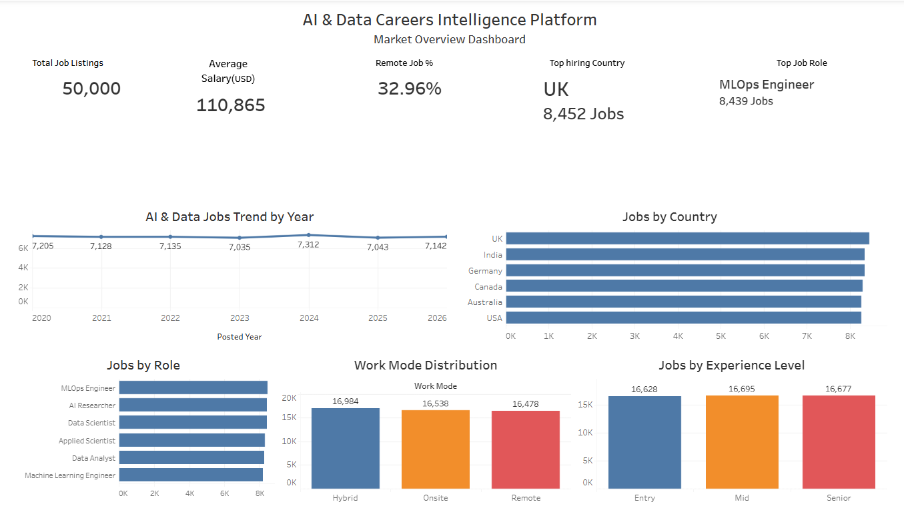
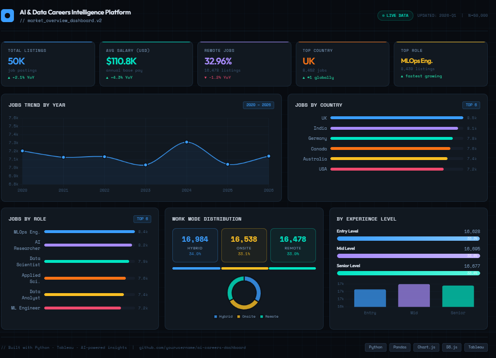

# AI & Data Careers Intelligence Platform

An AI-themed analytics dashboard project that analyzes global AI and Data career trends using cleaned job market data.

## Project Overview

This project explores the AI and Data job market by analyzing job listings, salary trends, remote work patterns, hiring countries, job roles, and experience-level demand.

The project includes two dashboard versions:

- **Tableau BI Dashboard** for business intelligence analysis and KPI storytelling
- **AI-Themed Web Dashboard** for a modern portfolio-style presentation

## Business Problem

Students and aspiring data professionals often struggle to understand which AI/Data roles, countries, and work modes are most relevant in the current job market. This dashboard helps convert job market data into clear insights for career planning and decision-making.

## Dashboard Versions

### Tableau BI Dashboard

The Tableau version focuses on BI-style analysis using cleaned job market data. It includes KPIs and visualizations for job listings, average salary, remote job percentage, top hiring country, top job role, yearly job trends, role distribution, work mode, and experience-level demand.

### AI-Themed Web Dashboard

The web version is built using HTML, CSS, JavaScript, and Chart.js. It presents the same key insights in a modern AI-style interface suitable for portfolio and GitHub Pages deployment.

## Key Metrics

- **Total Job Listings:** 50,000
- **Average Salary:** $110.8K
- **Remote Jobs:** 32.96%
- **Top Hiring Country:** UK
- **Top Job Role:** MLOps Engineer

## Tools & Technologies Used

- Tableau
- Excel
- HTML
- CSS
- JavaScript
- Chart.js
- GitHub Pages

## Dashboard Links

### AI-Themed Web Dashboard

[View Live Web Dashboard](https://yashikakedia.github.io/AI-Data-Careers-Dashboard/)

### Tableau BI Dashboard

[View Tableau Dashboard](https://public.tableau.com/views/AIDataCareersMarketOverviewDashboard/MarketOverview?:language=en-US&publish=yes&:sid=&:redirect=auth&:display_count=n&:origin=viz_share_link)

## Dashboard Preview

## Key Insights

- The dataset contains 50,000 AI and Data job listings.
- The average salary across roles is approximately $110.8K.
- Remote jobs account for 32.96% of total job listings.
- The UK appears as the top hiring country in the analyzed dataset.
- MLOps Engineer appears as the top job role by listing count.
- Job demand is distributed across Entry, Mid, and Senior experience levels.

## Project Outcome

This project demonstrates the use of data cleaning, KPI analysis, dashboard design, business intelligence storytelling, and web-based dashboard presentation. The Tableau dashboard shows analytical thinking, while the web dashboard adds a modern portfolio-ready interface.

## Author

**Yashika Kedia**
